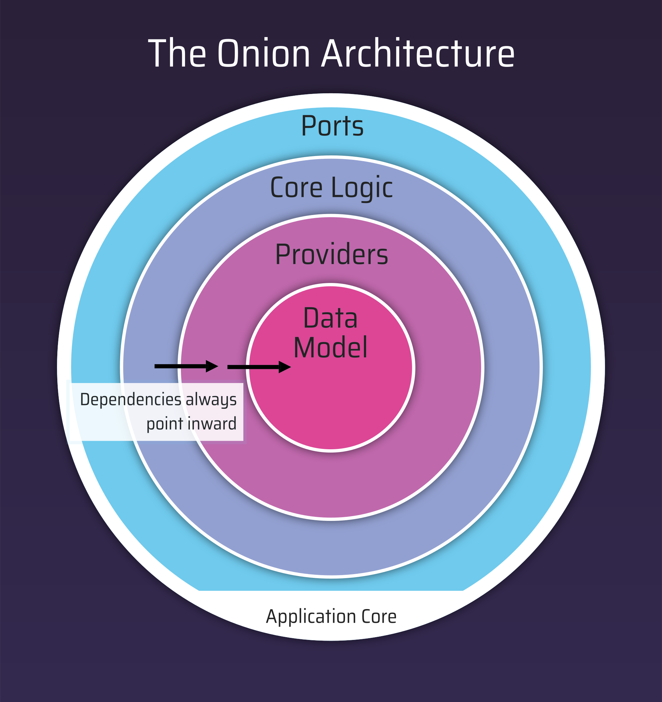

# NanoBus

NanoBus is a lightweight microservice runtime layer that simplifies your application's core logic by moving infrastructure concerns to composable flows.

## Key Features

### Virtually no boilerplate code

In conjunction with Dapr, NanoBus allows the developer to focus on defining APIs. The "glue" to make APIs accessible is handled automatically.

### Clean Architecture on top of Dapr

The structure of a NanoBus application follows design principles that allow your application to scale as requirements evolve. Newly created projects use a layout that serves as an intuitive blueprint to implement.

### Data-aware middleware / flows

Simplifies common tasks when communicating with other services and Dapr building blocks. Secure API endpoints, transform data, support multiple formats, and apply resiliency policies using simple configuration.

### Automatic API endpoints with documentation

Declaring services as specifications allows NanoBus to share your service through multiple protocals, including REST and gRPC. Standards like OpenAPI and Swagger UI are used to share your service with your partner teams.

### Consistent polyglot programming model

Nanoservices are small simplfied processes that plug into NanoBus and provide a uniform developer experience for services and actors, regardless of the choosen programming language.

## Architecture

NanoBus works jointly with [Dapr](https://dapr.io) to provide developers powerful building blocks such as service invocation,
state management, publish and subscribe, secret stores, bindings, and actors. These building blocks are accessed using flows which act as connective data pipelines. Inside flows, developer's use configurable actions to decode, transform and route data between application logic and Dapr's components. No SDKs required.

To expose services, NanoBus uses flexible interface definitions to automatically produce API endpoints, like HTTP-RPC, REST and gRPC. These transports are pluggable into NanoBus, allowing developers to expose services using multiple protocols without boilerplate code. Additionally, API documentation is auto-generated for the consumers of your services.

Finally, NanoBus supports pluggable "compute" types: from the containers you are using today, to emerging technologies
like [WebAssembly](https://webassembly.org). In the future, embedded language runtimes like JavaScript/TypeScript, Python or Lua will be featured.

The primary goal of NanoBus is to codify best practices into a sidecar so developers **focus on business outcomes, not boilerplate code**.

## Getting Started

* Install the [nanobus CLI](https://github.com/nanobus/cli#install-the-cli)
* Follow the tutorial under [examples](example/README.md)

## Design Concepts

### Ports and Adapters

Ports are simply entry and exit points of the application. Driving adapters wrap around a ports and instruct the application to perform an operation.

### Onion Architecture

The primary inspiration for NanoBus is the **Onion Architecture**, which is comprised of concentric layers that interface with each other towards the center. This design greatly improves a system's ability to evolve over time because each layer addresses a separate concern. Here are the layers NanoBus implements:

* **Core Logic** is where the developer focuses on implementing the service's behavior.
* **Provider Services** wrap around ports that invoke flows that act as driving adapters for Dapr or other components.
* **Data Model** (or domain modal) contains data structures for persistent data and events that are comminucated through port / flows.

 

### Flow-Based Programming

Between the Endpoints, Core Logic and Stores layers, NanoBus passes data through developer-defined flows: a paradigm called **Flow-Based Programming (FBP)**.

Each step in the flow can inspect, transform, and augment the data before passing it to the destination component.  Additionally, this mechanism externalizes encoding/decoding, authorization, cryptography and resiliency policies, eliminating the need to update the application internally. The application is only concerned with operations that accept and return strongly typed data structures.

### API-First Approach

To tie layers and flows together, the developer can *optionally* use an **API-First Approach**, where the operations of your service are described in an API specification that can be shared with other teams.

NanoBus uses a generic and protocol agnostic Interface Definition Language (IDL). This is input to our code generation tool, which creates RPC-style endpoints that your logic uses to interact with flows. NanoBus also uses the IDL to automatically host your services with REST, gRPC, and other protocols. This eliminates the need to write biolerplate code for the Transports, Endpoints, and Stores layers.

In NanoBus, the developer only needs to follow these steps:

1. Create a new service using the CLI
2. Define the services interfaces (IDL)
3. Create flows that tie operations to Dapr building blocks
4. Implement the service's core logic code
5. Run `make docker`
6. Deploy to your favorite container orchestrator

Check out the [tutorial](example/README.md) to try it out!

## Contributing

Please read [CONTRIBUTING.md](CONTRIBUTING.md) for details on the code of conduct and the process for submitting pull requests.

## License

This project is licensed under the [Apache License 2.0](https://choosealicense.com/licenses/apache-2.0/) - see the [LICENSE.txt](LICENSE.txt) file for details
